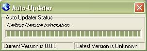



## Web Based Auto\-Updater

### Description

This code is a working (that i know of) Auto-Updater that uses the INet Control to connect to a webserver to update the files. Im currently using it in my project and its working beutifuly. The code is also EXTREAMLY Commented, i did this before submitting it. This is my first submission to psc so post comment if you have any problems.
 
### More Info
 

             |
---                |---
**Submitted On**   |2007-05-20 09:34:06
**By**             |[Joshua Vosdingh](https://github.com/Planet-Source-Code/PSCIndex/blob/master/ByAuthor/joshua-vosdingh.md)
**Level**          |Intermediate
**User Rating**    |4.7 (14 globes from 3 users)
**Compatibility**  |VB 6\.0
**Category**       |[Files/ File Controls/ Input/ Output](https://github.com/Planet-Source-Code/PSCIndex/blob/master/ByCategory/files-file-controls-input-output__1-3.md)
**World**          |[Visual Basic](https://github.com/Planet-Source-Code/PSCIndex/blob/master/ByWorld/visual-basic.md)
**Archive File**   |[Web\_Based\_2066535202007\.zip](https://github.com/Planet-Source-Code/joshua-vosdingh-web-based-auto-updater__1-68630/archive/master.zip)

